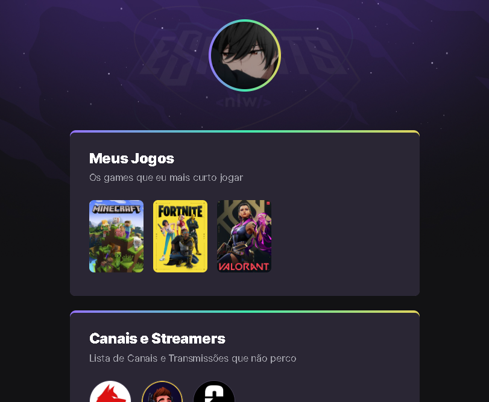

# NLW eSports 

> Trilha Explorer

Projeto construído do evento Next Level Week da Rocketseat.

[Clique aqui para acessar](https://SpeedSpectro.github.io/nlw-esports-explorer)

## 🛠 Tecnologias 

- HTML
- CSS
- Git e Github

## O que aprendi

 Antes de conhecer a Rocketseat eu não sabia que programar seria algo tão divertido a minha trilha explorer foi uma experiência incrível eu aprendi mutito sobre HTML, CSS, MD, SoftSkills, Foco e linguagem de programação e ainda tenho muito o que aprender porque eu quero ir mais além no mercado da programação. Quando eu mandei minha matrícula eu já estava pensando que a programação seria muito dificil e que eu não ia conseguir entender nada, mas como sempre a realidade quebra as expectativas, as aulas e as lives foram bem explicativas e eu consegui entender e desejo aprender ainda mais para que um dia eu vire um programador profissional. 

## ✉ Contato

> lucaseduardoribeiro3433@gmail.com
